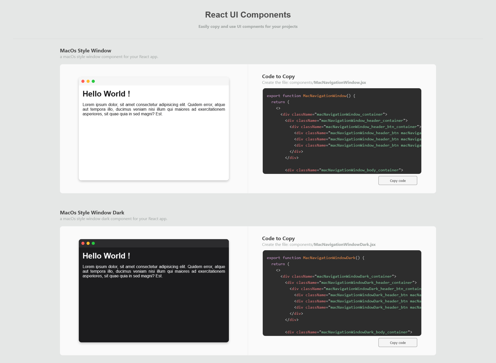

# 🚀 React UI Components

Copiez et utilisez facilement des composants UI dans vos projets React.



👉 **Voir les composants et les copier ici :**  
https://react-ui-components-five.vercel.app/

---

## ✨ Concept

Ce projet propose une collection de **composants React prêts à l’emploi** que vous pouvez :

- 👀 Visualiser en temps réel
- 📋 Copier en un clic
- ⚡ Coller directement dans votre projet

👉 Aucun install.  
👉 Aucune configuration.  
👉 Juste du copy/paste.

---

## 🧩 Comment ça marche ?

1. Rendez-vous sur le site  
2. Choisissez un composant  
3. Copiez le code  
4. Créez un fichier dans votre projet  
5. Collez le code — et c’est terminé ✅

---

## 🔥 Pourquoi ce projet ?

La plupart des librairies UI demandent :

- une installation
- des dépendances
- de la configuration

👉 Ici, non.

Tout est conçu pour être :

- ✅ **Plug & Play**
- ✅ **Accessible aux débutants**
- ✅ **Ultra rapide à intégrer**

---

## 🎯 Un composant = un fichier

Chaque composant contient :

- le JSX
- le CSS (directement dans le même fichier)

👉 Pas besoin de fichier CSS externe  
👉 Pas d’import supplémentaire  

### Exemple :

```jsx
export function MyComponent() {
  return (
    <>
      <div className="container">Hello</div>

      <style>{`
        .container {
          color: red;
        }
      `}</style>
    </>
  );
}